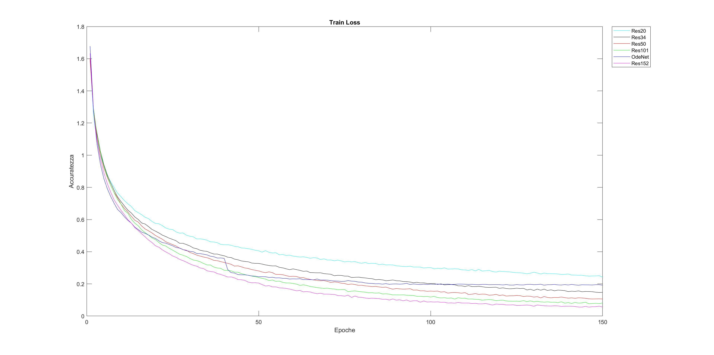

# ResNets
[](https://travis-ci.org/joemccann/dillinger)

In this repository you will fin several versions of Resnet for Image Classification Problem. 
The Resnets version are: 
 - Resnet20
 - Resnet32 
 - Resnet50 
 - Resnet101
 - Resnet152
 
The main goal is to optimize training error and accuracy and compare it with OdeNet Neural Network.
The comparison is important to show the performance with other approaches in particular with OdeNet.

### Model Description
The model is a Convolutional Neural Network with shortcuts as showed in this paper: https://arxiv.org/pdf/1512.03385.pdf

### Libraries
For develop ResNet I have used Python as language programmin and libraries for machine learning as follows:
 - Keras 2.3
 - TensorFlow 2.0
 - Python 3.6
 - Matplotlib

### Training
To train model you should run:
```sh
$ python resnet20.py
```

### Results

| | TrainAcc | TestAcc | TrainLoss | TestLoss |Params|
| ------ | ------ | ------ |  ------ |  ------ |  ------ |
| ResNet20 | 0,91 | 0,84 | 0,24 | 0,55 | 240,736 
| ResNet34 | 0,94 | 0,85 | 0,14 | 0,61 | 582,89 
| ResNet50 | 0,96 | 0,86 | 0,1 | 0,53 | 759,45
| ResNet110 | 0,97 | 0,87 | 0,08 | 0,58 | 1,520,458
| ResNet152 | 0,98 | 0,88 | 0,05 | 0,54 | 2,511,242
| OdeNet | 0,93 | 0,85 | 0,19 | 0,46 | 209,000




As you can see the training error will decrease with in deeper model. This is not possible with other CNN especially in deeper model. 
In this case we have seen a model of 152 blocks to be very performant than others. 

### Hyperparameters 
Optimizer: Adam 
Learning Rate in schedule from 0.001
Training Epoches: 150 
BatchSize: 32

